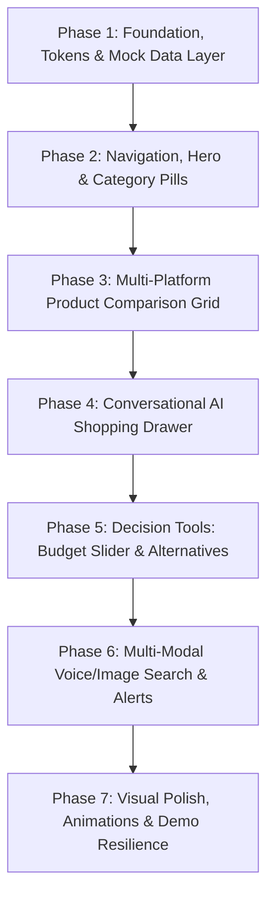

# 🛒 Frontend Workflow & Implementation Blueprint
## AI Personal Shopping Assistant (Problem Statement 05)

---

## 🧭 1. Executive Summary & Project Goal

The **AI Personal Shopping Assistant** eliminates the tedious problem of switching between **Amazon**, **Flipkart**, and **Myntra** by aggregating cross-platform product listings into a single intelligent dashboard.

Beyond price comparison, the frontend delivers actionable AI insights:
* **Sentiment Indicator (🟢 🟡 🔴):** Instant visual representation of review sentiment.
* **AI Quick Take & Review Summary:** 2-sentence synopsis of actual customer feedback.
* **"Best Overall" Badge:** Gold 👑 badge awarded based on a weighted multi-factor score (price, ratings, sentiment, seller trust).
* **Conversational AI Drawer:** Slide-out assistant with OpenRouter backend that parses natural language and renders interactive mini product cards in the chat.
* **"What If I Increase My Budget?" Slider:** Dynamic visual tool showing unlocked features for incremental spends (e.g., *"+₹500 upgrades you to 16GB RAM"*).
* **Alternative Finder:** Side-by-side Cheaper, Similar, and Premium upgrade suggestions.
* **Multi-Modal Search:** Voice search via the browser's Web Speech API and visual image search.
* **Price Alert Tracker:** Target price tracker with in-app toast notifications.

---

## 🎨 2. Design System & Style Tokens

### **Color Palette**
| Token | Hex / Value | Description |
| :--- | :--- | :--- |
| `--bg-primary` | `#0B0F19` | Main application dark canvas |
| `--bg-secondary` | `#0F172A` | Secondary container & panel background |
| `--glass-bg` | `rgba(18, 24, 38, 0.75)` | Glassmorphism card surface with 20px blur |
| `--glass-border` | `rgba(255, 255, 255, 0.08)` | 1px hairline border for cards |
| `--accent-cyan` | `#38BDF8` | Primary active accent & glows |
| `--accent-indigo` | `#818CF8` | Secondary accent & gradients |
| `--amazon` | `#FF9900` | Amazon platform tag & badge |
| `--flipkart` | `#2874F0` | Flipkart platform tag & badge |
| `--myntra` | `#FF3F6C` | Myntra platform tag & badge |
| `--sentiment-green` | `#10B981` | Positive sentiment indicator |
| `--sentiment-yellow` | `#F59E0B` | Mixed sentiment indicator |
| `--sentiment-red` | `#EF4444` | Negative/critical sentiment indicator |

### **Typography & Geometry**
* **Font Family:** `Outfit` (Headings & UI) + `Space Grotesk` (Monospace badges & prices).
* **Geometry:** Pill-shaped CTAs (`border-radius: 9999px`), 20–24px rounded glass containers.
* **Micro-Interactions:** Framer Motion spring physics, hover scale `1.02`, glowing ambient backdrops.

---

## 🗂️ 3. Frontend Directory & Component Tree

```
frontend/src/
├── assets/
│   ├── logos/                     # amazon.svg, flipkart.svg, myntra.svg
│   └── icons/
├── components/
│   ├── layout/
│   │   ├── Navbar.jsx              # Brand logo, search input trigger, voice btn, alerts counter, auth avatar
│   │   └── Footer.jsx              # Partner platform badges & hackathon credits
│   ├── hero/
│   │   ├── HeroSection.jsx         # Hero title, glowing search bar with voice/image buttons
│   │   └── CategoryPills.jsx       # Category chips (Electronics, Footwear, Fashion, Home)
│   ├── products/
│   │   ├── ProductGrid.jsx         # Comparison grid rendering multi-platform product sets
│   │   ├── ProductCard.jsx         # Multi-platform card with badge, price, discount, delivery, sentiment
│   │   ├── PlatformBadge.jsx       # Amazon🟠 / Flipkart🔵 / Myntra🔴 branded pills
│   │   ├── BestOverallBadge.jsx    # Gold 👑 pick badge with score breakdown tooltip
│   │   ├── SentimentBadge.jsx      # 🟢 🟡 🔴 pill with expandable pros/cons popup
│   │   └── ProductDetailModal.jsx  # Specs comparison table, AI summary, raw reviews
│   ├── chat/
│   │   ├── ChatDrawer.jsx          # Slide-out AI assistant drawer
│   │   ├── ChatMessage.jsx         # User & AI message bubbles with embedded mini cards
│   │   ├── ProductMiniCard.jsx     # Compact product card rendered inside chat stream
│   │   └── PromptSuggestions.jsx   # Clickable starter prompt chips
│   ├── tools/
│   │   ├── BudgetSlider.jsx        # "What if I add ₹X?" dynamic upgrade explorer
│   │   ├── AlternativeFinder.jsx   # 3-column: Cheaper / Similar / Premium alternatives
│   │   └── PriceAlertModal.jsx     # Target price input & active alerts manager
│   ├── search/
│   │   ├── VoiceSearchModal.jsx    # Web Speech API with microphone pulse animation
│   │   ├── ImageSearchModal.jsx    # Drag-and-drop / file upload modal for visual search
│   │   └── FilterSidebar.jsx       # Price range, platform toggles, brand filter, sort dropdown
│   └── common/
│       ├── GlassCard.jsx           # Reusable glassmorphic container
│       ├── SkeletonLoader.jsx       # Shimmer loading cards
│       └── Toast.jsx               # In-app toast notification
├── context/
│   ├── AuthContext.jsx             # Google OAuth / JWT authentication session
│   └── ShoppingContext.jsx         # Global: query, results, filters, selectedProduct, chat, alerts
├── hooks/
│   ├── useVoiceSearch.js           # Browser SpeechRecognition hook
│   ├── useDebounce.js              # Debounce search input (400ms)
│   └── useShopping.js              # Convenience hook for ShoppingContext
├── services/
│   ├── api.js                      # Axios instance with auto-fallback to mock data
│   └── mockData.js                 # Fallback offline catalog for guaranteed demo resilience
├── App.jsx                         # Main dashboard view orchestrating components
└── main.jsx
```

---

## 🚀 4. Phased Implementation Roadmap



---

### **Phase 1: Design Tokens, Global State & Mock Service Layer**
* **Goal:** Enable immediate UI development with rich test data independent of backend readiness.
* **Deliverables:**
  1. `frontend/src/index.css`: Define CSS variables for dark theme, glass backgrounds, and platform/sentiment colors.
  2. `frontend/src/services/mockData.js`: Create a realistic multi-platform catalog (60+ items across Electronics, Footwear, Fashion, Home) with full AI metadata (`sentiment`, `review_summary`, `why_buy`, `best_overall_score`, `specs`).
  3. `frontend/src/services/api.js`: Setup Axios client configured to attempt backend endpoints (`http://localhost:5000/api`) with instant automatic fallback to `mockData.js`.
  4. `frontend/src/context/ShoppingContext.jsx`: Global context managing:
     * `query`, `category`, `results`, `loading`, `filters`, `sortBy`
     * `selectedProduct`, `chatDrawerOpen`, `activeAlerts`.

---

### **Phase 2: Navigation, Hero & Category Navigation**
* **Goal:** Create a high-converting, modern landing experience.
* **Deliverables:**
  1. `Navbar.jsx`:
     * Glowing brand lockup.
     * Voice search trigger, price alert counter with bell icon, Google profile avatar / login button.
  2. `HeroSection.jsx`:
     * Headline: *"Stop Tab Switching. Let AI Find Your Best Deal."*
     * Interactive search input with instant clear button, microphone button, and image search button.
  3. `CategoryPills.jsx`:
     * Filter chips: `🔥 Trending Deals`, `🎧 Electronics`, `👟 Footwear`, `👕 Fashion`, `🏠 Home`.

---

### **Phase 3: Multi-Platform Product Comparison Grid (Core Anchor)**
* **Goal:** Display normalized comparison cards with instant visual AI cues.
* **Deliverables:**
  1. `PlatformBadge.jsx`: Branded badges for Amazon (Orange), Flipkart (Blue), and Myntra (Pink).
  2. `SentimentBadge.jsx`: 🟢 / 🟡 / 🔴 pills. Hovering or clicking displays an AI pros/cons tooltip.
  3. `BestOverallBadge.jsx`: Gold 👑 badge with score breakdown (e.g., *"Score: 94/100 • 30% Price Value + 30% Rating + 25% Sentiment + 15% Delivery"*).
  4. `ProductCard.jsx`:
     * Clean product image, discount pill (`-20%`), delivery ETA.
     * Price vs. original price strike-through.
     * 1-sentence "Why Buy This" AI justification.
     * Action buttons: *"Compare"* and *"Set Price Alert"*.
  5. `FilterSidebar.jsx`: Price range dual-slider, platform toggles, brand filter, sort dropdown.
  6. `ProductDetailModal.jsx`: Full modal with spec comparisons across platforms, raw user reviews, and AI summary.

---

### **Phase 4: Conversational AI Shopping Drawer**
* **Goal:** Provide a natural-language shopping assistant that embeds product cards in conversation.
* **Deliverables:**
  1. `ChatDrawer.jsx`: Slide-out panel from the right with Framer Motion slide transitions.
  2. `PromptSuggestions.jsx`: Clickable prompt chips:
     * *"Best noise-cancelling headphones under ₹5,000"*
     * *"Compare Sony WH-1000XM5 on Amazon vs Flipkart"*
     * *"Cheapest running shoes with 4+ rating"*
  3. `ChatMessage.jsx` & `ProductMiniCard.jsx`:
     * User and AI chat bubbles with markdown support.
     * Inline horizontal product cards with direct *"View Deal"* or *"Compare"* buttons.

---

### **Phase 5: Decision Tools (Budget Slider & Alternative Finder)**
* **Goal:** Enable visual trade-off analysis instead of manual re-searching.
* **Deliverables:**
  1. `BudgetSlider.jsx` ("What If I Increase My Budget?"):
     * Drag slider: `+₹500`, `+₹1,000`, `+₹2,500`, `+₹5,000`.
     * Live display of unlocked upgraded products with an upgrade banner explaining the advantage (e.g., *"+₹1,000 gets you Active Noise Cancellation & 40h battery"*).
  2. `AlternativeFinder.jsx`:
     * 3-column comparison matrix for any selected item:
       * 💰 **Cheaper Alternative** (Budget save)
       * 🔄 **Direct Competitor** (Same spec on another platform)
       * ⭐ **Premium Upgrade** (Higher build quality/ratings)

---

### **Phase 6: Multi-Modal Discovery & Price Alerts**
* **Goal:** Add speech input, visual search, and alert tracking.
* **Deliverables:**
  1. `VoiceSearchModal.jsx` & `useVoiceSearch.js`:
     * Uses native browser `window.SpeechRecognition` / `webkitSpeechRecognition`.
     * Shows a pulsating microphone ripple animation and live speech-to-text transcript, auto-triggering search when speech finishes.
  2. `ImageSearchModal.jsx`: Drag-and-drop dropzone or camera snapshot trigger.
  3. `PriceAlertModal.jsx` & `Toast.jsx`: Target price input dialog; updates active alerts and shows animated in-app toast alerts.

---

### **Phase 7: Visual Polish, Animations & Pitch Readiness**
* **Goal:** Ensure 100% demo smoothness for judges.
* **Deliverables:**
  1. `SkeletonLoader.jsx`: Shimmer placeholders during search queries.
  2. `framer-motion`: Smooth layout transitions when filtering or sorting cards.
  3. `canvas-confetti`: Trigger celebration when setting an alert or choosing the "Best Overall" pick.
  4. Guaranteed offline fallback so live API rate limits or network drops will never break the presentation.

---

## 📡 5. Frontend API Data Contracts

### 1. Multi-Platform Search (`POST /api/search`)
```json
// Request
{
  "query": "running shoes",
  "category": "footwear",
  "minPrice": 1000,
  "maxPrice": 5000,
  "sortBy": "best_value"
}

// Response
{
  "count": 3,
  "bestOverallId": "prod-puma-flipkart",
  "results": [
    {
      "id": "prod-puma-flipkart",
      "groupId": "puma-nitro-runner",
      "title": "Puma Velocity Nitro 2 Running Shoes",
      "brand": "Puma",
      "platform": "flipkart",
      "price": 3499,
      "originalPrice": 5999,
      "discountPercent": 42,
      "rating": 4.5,
      "reviewCount": 3840,
      "deliveryEstimate": "2-3 Days",
      "imageUrl": "https://images.unsplash.com/photo-1542291026-7eec264c27ff?w=500",
      "productUrl": "https://flipkart.com",
      "sentiment": "green",
      "sentimentScore": 91,
      "reviewSummary": "Superb midsole cushioning and durable grip on wet roads. Sizing runs slightly narrow.",
      "whyBuy": "Highest discount (42% off) with premium Nitro foam tech.",
      "isBestOverall": true,
      "specs": {
        "Weight": "257g",
        "Cushioning": "Nitro Foam",
        "Surface": "Road"
      }
    }
  ]
}
```

### 2. Conversational Chat (`POST /api/chat`)
```json
// Request
{
  "message": "Find me comfortable shoes for marathon training under 4000",
  "history": []
}

// Response
{
  "reply": "Based on user sentiment and shock absorption ratings, here are the top 2 marathon shoes under ₹4,000:",
  "suggestedProducts": ["prod-puma-flipkart", "prod-nike-myntra"],
  "appliedFilters": { "maxPrice": 4000, "category": "footwear" }
}
```

---

## 📊 6. Feature Verification Checklist

| Feature | Component | Verification Criteria |
| :--- | :--- | :--- |
| **Multi-Platform Search** | `ProductGrid.jsx` | Shows Amazon, Flipkart, and Myntra cards for same search query |
| **AI Sentiment Badge** | `SentimentBadge.jsx` | 🟢 / 🟡 / 🔴 badges render with tooltip explaining pros & cons |
| **Best Overall Pick** | `BestOverallBadge.jsx` | Gold 👑 badge renders on top-scored card with score breakdown |
| **AI Chat Assistant** | `ChatDrawer.jsx` | Natural language input returns answer + interactive mini cards |
| **Budget Slider** | `BudgetSlider.jsx` | Adjusting slider reveals unlocked specs and upgraded products |
| **Alternative Finder** | `AlternativeFinder.jsx` | Displays Cheaper, Similar, and Premium alternatives |
| **Voice Search** | `VoiceSearchModal.jsx` | Speaks query → transcribes text → triggers live search |
| **Price Alert** | `PriceAlertModal.jsx` | Setting target price shows toast and increments active alerts count |
| **Offline Resilience** | `api.js` | Works seamlessly even if backend server is not running |

---

## 🏆 7. Recommended Demo Flow for Hackathon Presentation

1. **The Hook (30 sec):** Open dashboard, highlight the problem of tab-switching across Amazon, Flipkart, and Myntra.
2. **Search & Compare (45 sec):** Search *"Noise cancelling headphones"* → showcase multi-platform cards with Amazon🟠, Flipkart🔵, Myntra🔴 badges, sentiment pills, and the 👑 **"Best Overall"** badge.
3. **AI Chat Assistant (45 sec):** Open chat drawer, click a suggestion chip (*"Best laptop for student coding under ₹60,000"*), watch the assistant parse constraints and return inline cards.
4. **"What If I Increase My Budget?" (30 sec):** Move the budget slider by +₹1,000 → show the live feature unlock (*"Doubles battery life & adds ANC"*).
5. **Multi-Modal Voice Search (30 sec):** Click microphone, speak *"Running shoes under ₹3000"* → live speech-to-text triggers search instantly.
6. **Closing (20 sec):** Set a price alert, trigger confetti celebration, and summarize impact.
